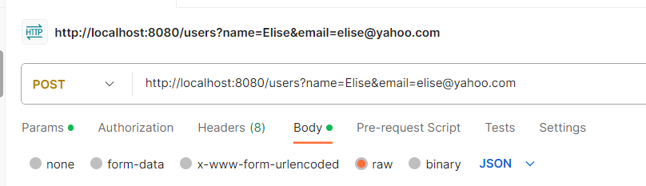

All of the changes to original **ticket-booking** are in the .migration packages.

Demo:

created 4 instances in postgresql via user controllers. Ex.:

PostgreSQL:

after running migration trigger

migrated data:

after running aggregation request:
